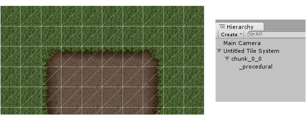

Procedural tiles are presented using meshes that are procedurally generated on a per chunk
basis. These can be painted and erased incredibly quickly and generally incur fewer draw
calls than non-procedurally painted tiles.

Whilst game objects are not created for each tile, it is possible to attach game objects
by specifying an attachment prefab, see [Attach Prefab]. Colliders can also be added very
easily, see [Add Collider].

[Add Collider]: ./Tileset-Brush-Properties.md
[Attach Prefab]: ./Tileset-Brush-Properties.md
