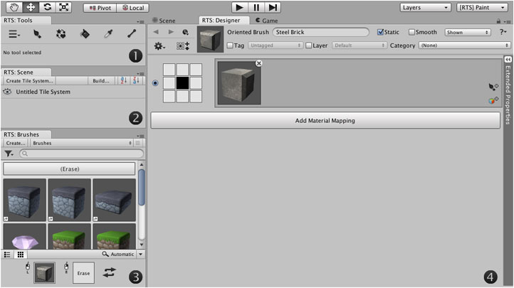

Once you’ve installed 'rotorz/unity3d-tile-system' into your project you can open the tool
palette using the menu **Window | Rotorz Tile System**. This interface is the main
entrance point to this extension and provides access to various commands and other
interfaces.

## Setting up the user interface

With many thanks to customer feedback we have opted to separate our interface into
multiple dockable windows allowing you to customize your editor environment to better meet
your workflow. It is generally useful to dock the various palette windows into the main
Unity interface, though this is entirely a matter of preference.

The following interfaces can be accessed via the main tool menu
** | Editor Windows**:

1. **[Tool Palette]** - Includes tools for interacting with tile systems.

2. **[Scene Palette]** - Useful when working with multiple tile systems.

3. **[Brush Palette]** - Lists brushes and allows selection for painting.

4. **[Designer]** - Allows you to modify the active brush or tileset.

>
> **Tip** - The **Tool** and **Brush** interfaces can be joined into a single palette
> window by modifying [User Preferences].
>

## Setting up your scene

Tiles are painted onto a special kind of object called a [tile system] which must be
present before you can begin to paint tiles. You can add one or more tile systems into
your scene which can be positioned as needed (see [Creating a Tile System]).

Here are two common reasons to use multiple tile systems:

- Stack multiple tile systems to create layers of tiles.

- Define multiple grid sizes (i.e. large tiles and small tiles).

## Painting tiles onto a tile system

1. With your tile system selected, activate the [Paint Tool].

2. Select the brush that you would like to paint with by left clicking it in palette.

3. Use left mouse button to paint tiles onto the selected tile system.

4. Drag mouse pointer whilst holding left mouse button to paint a line of tiles.

Once you have finished painting you can deactivate the selected tool by re-clicking the
associated tool button, or by selecting one of the standard Unity tools.

## Creating and designing new brushes

There are several kinds of brush which can be created allowing you to paint different
kinds of tile. Prefabs can be added to oriented brushes allowing you to paint 3D tiles
with custom behavior scripts attached. Tileset brushes can be created allowing you to
paint 2D tiles; prefabs can be attached to painted tiles when desired.

An existing brush can be opened into the designer by right-clicking on it using the
**Brush** palette and then selecting **Show in Designer...** from the context menu.

See [Brushes] for further information.

## Optimizing the tile systems in your scene

Tile meshes and colliders can be merged and unwanted aspects of tile systems can be
stripped from final project builds by optimizing your tile systems. The way in which each
tile system is optimized can be configured using the inspector.

The **Build Scene** command allows you to quickly optimize all of the tile systems in the
current scene which is then saved to a separate *built* version of scene. It is generally
a good idea to avoid making changes to built version of scene since such changes will be
lost if original version of scene is built again.

See [Tile System Optimization] for further information.

[Brush Palette]: ./Brush-Palette.md
[Brushes]: ./Brushes.md
[Creating a Tile System]: ./Creating-a-Tile-System.md
[Designer]: ./Designer-Window.md
[Paint Tool]: ./Paint-Tool.md
[Scene Palette]: ./Scene-Palette.md
[Tile System Optimization]: ./Tile-System-Optimization.md
[Tool Palette]: ./Tool-Palette.md
[User Preferences]: ./User-Preferences.md
[tile system]: ./Tile-Systems.md
