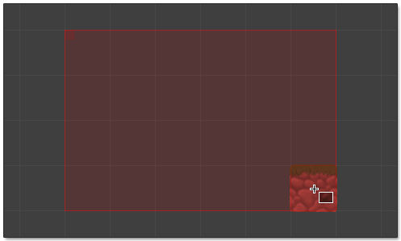
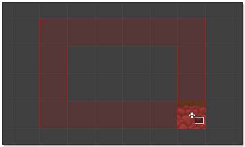

 Paints filled or outline of rectangle by dragging with
left or right mouse button pressed.

- Use **left mouse** button to paint tiles using primary brush.

- Use **right mouse** button to paint tiles using secondary brush.

>
> **Shortcut Key:** With tile system selected press **U** to select tool.
>

**Fill Mode**
:  Center area of rectangle is filled
  when selected:

  

   Outline of rectangle is drawn
  when selected:
  
  
