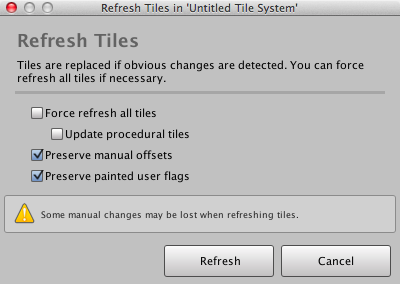

Sometimes it is necessary to refresh previously painted tiles when their associated brush
or linked prefab has been modified. Fortunately this can be resolved by refreshing the
tiles.

## Prerequisite

Ensure that **Inspector** window is shown by selecting **Window | Inspector**.

## Steps

1. Select your tile system.

2. Click **Refresh...** button in tile system inspector.

   You should then see the following window:

   

3. Review and tick/untick the provided options:

   - **Force refresh all tiles** - Repaints all tiles using the brush that was previously
     used to paint them. Components and properties that have been manually tweaked will be
	 reset to their original state.

   - **Update procedural tiles** - Regenerates procedural meshes.

   - **Preserve manual offsets** - Attempts to preserve manually tweaked position,
     rotation and scale for tiles that are repainted.

   - **Preserve painted user flags** - Attempts to preserve current flag states for tiles
     that are repainted. This option must be deselected to reflect changes that have been
	   made to brushes.

4. Click **Refresh**.
