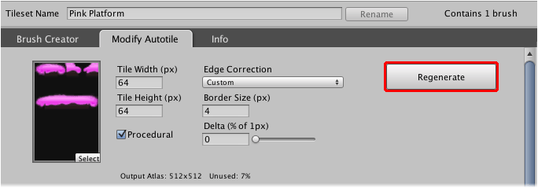

An autotile atlas can be regenerated to reflect changes that have been made to the input
artwork. Previously painted tiles will be updated automatically to reflect such changes.

## Context

The generated atlas texture will be overwritten if autotile atlas is regenerated. You
should retain a backup of any modifications that you have made to the atlas texture just
in case you accidentally lose them.

## Steps

1. Select tileset using **Brush** palette and select menu command
   ** | Show in Designer...**.

2. Select **Modify Autotile** tab.

   

3. Click **Regenerate**.
