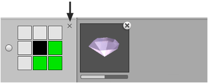
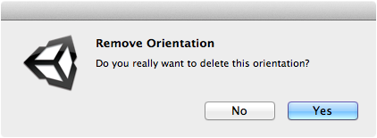

Unwanted orientations can be removed by clicking the small cross button shown to right of
3x3 icon.

## Context

The default orientation cannot be removed. If the default orientation is not wanted then
you must first mark another orientation as the default.

## Steps

1. Right-click brush using **Brush** palette and select **Show in Designer...** from menu.

2. Click **Remove Orientation** cross button on the orientation that you want to remove.

   

   A confirmation message should appear:

   

3. Select **Yes** to remove orientation.
