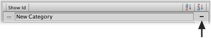

Brush categories can be removed using the 'rotorz/unity3d-tile-system' project settings
asset using the **Inspector**.

## Context

Any brushes placed within a category that is removed will remain in the category, but will
only be accessible when using the **Show All** filter.

## Steps

1. Select menu **Edit | Project Settings | Rotorz Tile System**.

   You should then see the "Project Settings" configuration of 'rotorz/unity3d-tile-system'
   in the **Inspector**.

2. Click **Remove** button to the right of the category that is to be removed.

   
