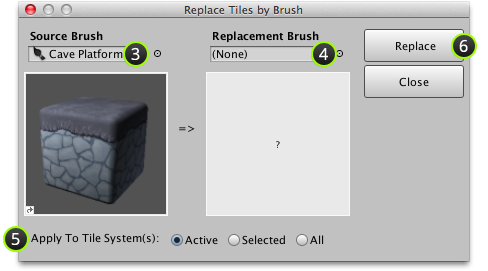

You can quickly repaint tiles which were painted using one brush with another brush. Think
of this as find and replace for tiles!

## Steps

1. (Optional) Select tile system(s) that you would like to alter.

   Skip this step if you would like to find and replace tiles for all tile systems in
   the scene.

2. Select menu command ** | Replace by Brush...**.

   The following window should then be shown:

   

3. (Optional) Select **Source Brush**.

   Field is automatically populated with primary brush.

4. Select **Replacement Brush**.

   All instances of source brush will be repainted with this brush.

5. Specify tile system(s) which find and replace should operate on:

   - **Active** - The active tile system.

   - **Selected** - All editable tile systems in current selection.

   - **All** - All editable tile systems in scene.

   >
   > **Caution** - Always verify that this option is set correctly.
   >

6. Click **Replace** to perform find and replace.
