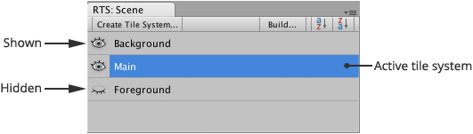
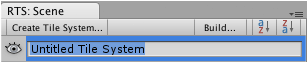

Displays list of editable tile systems in the current scene allowing quick selection of
the active tile system. Tile systems can be shown, hidden, renamed and rearranged using
this interface.

This interface can be displayed via the tool menu ** |
Editor Windows | Scene**.

The labels of tile systems can be dragged and dropped onto other user interfaces which is
useful when associating tile systems with custom scripts.

Right click on tile system to reveal handy context menu.

## Tile System Visibility

Tile systems can be temporarily hidden to reveal obscured tiles and objects in your scene
by clicking the toggle icon.

-  - Shown when tile system is visible, click to hide
  tile system.

-  - Shown when tile system is hidden, click to reveal
  tile system.

## Reordering Tile Systems

Tile systems can be manually ordered by dragging them within the scene palette which is
particularly useful when you have multiple layers of tile systems in your scene.

- Tile systems can be dragged and dropped within scene palette.

- Click  (Sort Ascending) to sort list of tile systems by name
  in ascending order.

- Click  (Sort Descending) to sort list of tile systems by
  name in descending order.

Ordering of tile systems does not affect the order in which they are rendered in your game.
To change the visual ordering of tile systems you must adjust the position of your tile
system using the move tool (or alternatively using the transform inspector).

## Locking Tile Systems

Tile systems can be locked to avoid inadvertent interaction with the active paint tool.

It is not possible to paint or erase tiles on locked tile systems and most actions are
disabled to prevent accidental alterations. Placeholder messages are shown within scene
view and inspector indicating that tile system must be unlocked before changes can be made.

Tile system can be locked or unlocked by context clicking tile system and then toggling
**Lock**. A small padlock icon  is shown to denote that a tile
system has been locked.

## Renaming a Tile System

You can rename tile systems using the scene palette in much the same way as you would with
the standard hierarchy window.

1. Right-click on the tile system that you would like to rename.

2. Select **Rename** from context menu.

   Rename field can also be shown using the hot key **F2** (Windows) or **Return** (OS X)
   when scene palette is focused.
   
   You should then see something like the following:

   

3. Input new name for tile system.

4. Press **Return** key to accept new name, or press **Escape** key to cancel.
