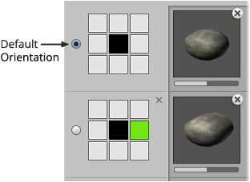

Each oriented brush has a default orientation which is marked using the radio button
towards the left.

## Steps

1. Right-click brush using **Brush** palette and select **Show in Designer...** from menu.

2. Click radio button at left of orientation to mark as default.

   
