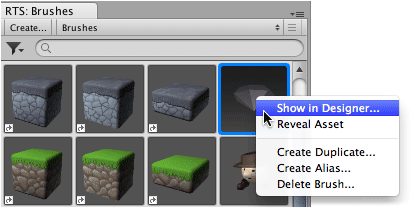

Selected brush is automatically shown in designer when designer window is already open,
otherwise can be accessed via context menu by right-clicking brush in palette.

## Prerequisite

Ensure brush palette is shown by selecting ** |
Editor Windows | Brushes**.

>
> **Shortcut** - Double-click brush to quickly show designer.
>

## Steps

1. Right-click brush in **Brush** palette.

2. Select **Show in Designer...** from context menu.

   
