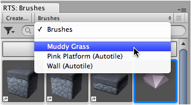
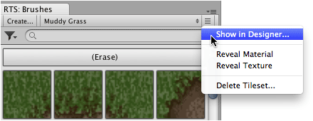

Designer for active tileset can be accessed via the tileset context menu in brush palette.

## Prerequisite

Ensure brush palette is shown by selecting ** |
Editor Windows | Brushes**.

## Steps

1. Select tileset in **Brush** palette.

   

2. Select menu command ** | Show in Designer...**.

   
