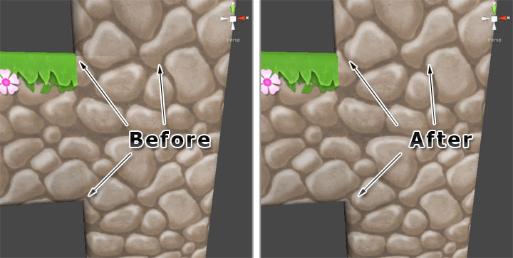

Whilst vertex snapping helps to avoid visual anomalies, you may still encounter issues
regarding normals leading to lighting artifacts.

This issue is caused where the normals of adjacent tiles are not calculated smooth against
each other. Modelling packages usually provide normal smoothing functionality, however it
is not always possible to pre-smooth tiles that are designed to be used in a number of
ways.

The illustration below shows how some tiles appear smooth whilst others do not. This can
be corrected by marking the brushes as both **static** and **smooth**. Tiles painted using
such brushes will be automatically smoothed using the vertex snapping threshold when tile
system is built.

