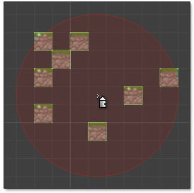

 Use spray tool to randomly scatter tiles onto a tile system.

-Use **left mouse** button to paint tiles using primary brush.

-Use **right mouse** button to paint tiles using secondary brush.

**Fill Rate (%)**
: Rate at which to fill nozzle area with tiles. Use lower value to reduce quantity of
  tiles painted.

## Paint Line of Tiles

Hold **Shift** key to paint line of tiles from previously painted tile to cursor. Visual
representation of line is shown whilst key is held as illustrated below:

## Paint Straight Line of Tiles

Hold both **Shift** and **Ctrl** keys to paint horizontal or vertical line of tiles more
easily:

