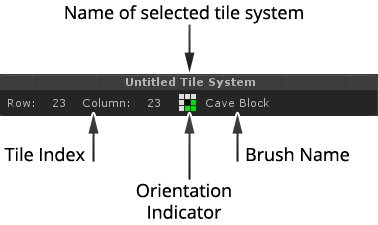
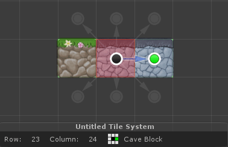
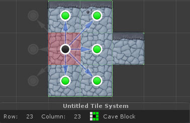
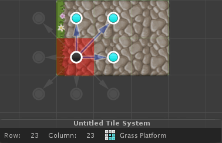
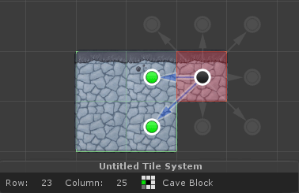
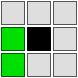
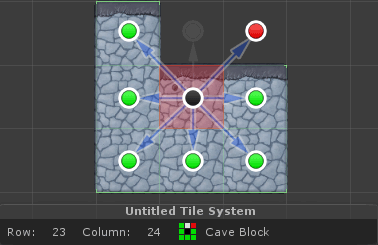
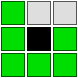

The status panel reflects the state of the highlighted tile when a tool is selected. This
is useful when developing oriented brushes.

The status panel reflects the state of the active tile when a tool is selected. The active
tile is highlighted with a red wireframe box near the mouse pointer when looking at the
scene view. The status panel is broken down as shown below:

## Orientation Indicators

The orientation indicator is often useful when developing oriented brushes because it
shows which brush orientation was used along with the actual orientation of the tile. By
looking at the colors presented it is possible to determine:

- When a fallback orientation was used.

- Which fallback orientation was used.

- The actual orientation of the tile.

>
> **Remember** - Whilst the presence of red and gray indicators hint that brush does not
> contain the actual orientation, it does not necessarily mean that there is an error.
> Though this can be extremely useful when you see that the wrong tile has been painted
> because you can see what went wrong.
>

The following legend describes what each of the colors indicate:

### Indicator Color: White

Indicates that the surrounding tile is either empty or that the coalescing rules of the
tile exclude it from the orientation of the active tile.

For example, in the illustration to the left you can see that the active tile coalesces
with the tile to its right because it is another "Cave" tile. However the block to its
left is a "Grass" tile that is configured to coalesce with other "Grass" tiles only.

### Indicator Color: Green

Indicates that the surrounding tile coalesces with the active tile, and that the brush
orientation that was used to paint the active tile matches the surrounding tile.

If indicator is entirely white and green then the painted tile was matched exactly as
defined within brush.

### Indicator Color: Cyan

Same as with green except indicates that tile was painted with rotation.

### Indicator Color: Gray

Indicates that the surrounding tile is a part of the **actual** orientation of the active
tile, but the brush orientation that was used to paint the active tile **did not match**
the surrounding tile.

If the active tile was not appropriate in this example, it would be necessary to define
the following orientation:

### Indicator Color: Red

Indicates that the surrounding tile is not part of the **actual** orientation of the
active tile, but the nearest available brush orientation that was used to paint the active
tile **did match** the surrounding tile.

If the active tile was not appropriate in this example, it would be necessary to define
the following orientation:

