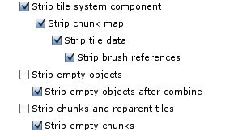

Tile systems contain a lot of data and functionality that is often not required at
runtime (though is essential at design time). These unwanted aspects can be stripped
upon building a tile system.

At runtime tile data is stored within tile system and chunk components so that both tiles
and chunks can be accessed easily. This data can be discarded using the appropriate
stripping options.

Whilst the majority of these stripping options are best appreciated for optimized tile
systems, some of them can be applied at runtime when tile systems receive their first
`Awake` message (see [Runtime Options]).

## Stripping Presets

A number of stripping presets have been provided to cater for the most common use cases.

Stripping capabilities are reduced when procedurally generated tiles are present (unless
they are pre-generated by selecting **Pre-generate Procedural** option). This is because
tilesets and tile data are required to generate procedural tiles.

### **Strip Runtime** (default)

Remove runtime functionality.

### **Keep System Component**

Remove runtime functionality but retain tile system component so that it is still possible
to calculate the index of a tile from a position in world space, calculate tile index from
ray casting, etc.

>
> **Remember** - Tile data is unavailable!
>

### **Runtime Access**

Preserve ability to access tile data at runtime.

### **Runtime Painting**

Preserve ability to paint tiles and access tile data at runtime.

### **Strip Everything**

Perform maximum level of stripping.

### **No Stripping**

Do not perform any stripping.

### **Custom**

Define custom, see [Stripping Options].

>
> **Note** - Selecting or deselecting certain stripping options will automatically cause
> dependent options to be altered.
>
> For example, it is not possible to select "Strip tile system component" whilst at the
> same time deselecting "Strip chunk map".
>

## Stripping Options

Overview of custom stripping options that can be specified.

### Strip tile system component

Removes `TileSystem` component from tile system game object.

### Strip chunk map

Removes chunk map from tile system component and removes `Chunk` components from chunk
game objects.

### Strip tile data

Removes tile data from tile system chunk components.

### Strip brush references

Clears brush references from tile data.

### Strip empty objects

Removes most empty game objects.

### Strip empty objects after combine

Removes game objects that have become empty after being combined with other tiles. Game
objects will not be removed if they still contain components (like a collider, for example).

### Strip chunks and reparent tiles

Removes chunk game objects and moves tile game objects into tile system game object.

### Strip empty chunks

Removes chunk game objects that are empty or that have become empty during build process.

### Strip plop instance / group components

Special components are automatically added to plop instances and group objects allowing
greater control over interaction with plops; for instance, allowing picking and erase.

Whilst these components may be useful in custom scripts, they are not required at runtime
and can be stripped to save memory.

[Runtime Options]: ./Tile-System-Runtime-Options.md
