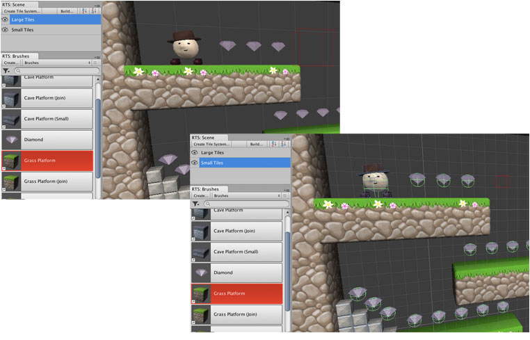

When your scene contains a number of tile systems it is useful to be able to switch
between them quickly when painting.

The [Scene Palette] (** | Editor Windows | Scene**)
makes it easier to switch between tile systems when painting. More importantly it
remembers the previous tile system that you painted on allowing you to quickly resume
painting simply by selecting a tool.

## Keyboard Shortcuts

The following keyboard shortcuts can be used within scene views when a tool is selected.

| Shortcut       | Description                                             |
|----------------|:--------------------------------------------------------|
| **Page Up**    | Select previous tile system using scene palette order.  |
| **Page Down**  | Select next tile system using scene palette order.      |

You can also assign keyboard shortcuts to make it even easier to switch to and from
specific tile systems. Please refer to the Unity documentation for further details:
<http://docs.unity3d.com/Manual/UnityHotkeys.html>.

[Scene Palette]: ./Scene-Palette.md
