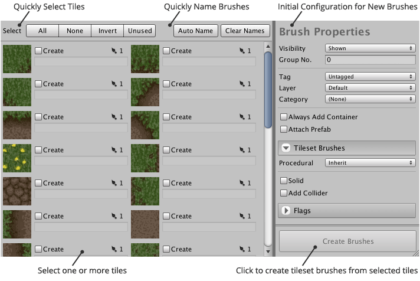

Tileset brushes can be created using the brush creation interface of the tileset designer.
Brushes can be created in batches by selected multiple tiles.

## Tiles

Each available tile in the active tileset is listed on the left side of the brush creator
interface. The following interface elements are presented for each tile.

Tile Thumbnail
: Thumbnails exclude additional border space making them easier to understand. Tile
  previews are stretched to fit the thumbnail area which may cause them to appear distorted.

Create Toggle Field
: Selecting this field indicates that a new brush should be created to represent the tile.
  This makes it easier for you to create brushes for a selection of tiles.

Brush Name
: Allows you to specify the name will be assigned to the newly created brush. Selecting
  this field will automatically select the **Create** toggle field.

  An error message will be displayed directly below this field if a naming conflict or
  input error is detected.

Count of Brushes for Tile
: Displays the total number of brushes that have been created for tile.

  Clicking this button will navigate to the brush. A popup menu is displayed when there is
  more than one brush for tile allowing you to pick the specific instance that you would
  like to navigate to.

## Tile Selection

A series of buttons are displayed immediately above the list of available tiles which
allow you to quickly select the tiles that you would like to create brushes for.

All
: Select all tiles.

None
: Deselect tiles.

Invert
: Invert the current selection of tiles.

Unused
: Select tiles that do not have an associated brush.

## Naming Brushes

These buttons allow you to automatically populate the brush name field of each tile where
**Create** has been selected.

Auto Name
: Assigns a unique name for each tile.

Clear Names
: Erase name field for each tile.

## Brush Properties

When creating a batch of brushes it is often useful to assign the same properties to each
newly created brush. This panel allows you to do just that!

The properties presented at the top of this panel will be applied to both tileset and
autotile brushes upon creation. The remaining properties have been grouped into foldout
sections:

Tileset Brushes
: Properties that only apply to regular tileset brushes.

  >
  > **Note** - These properties are ignored when creating autotile brushes.
  >

Autotile Brushes
: Properties that only apply to autotile brushes. This section is displayed when an
  autotile brush has been elected for creation.

Flags
: Flags that will be used when painting tiles. Flags will be assigned to each created brush.
