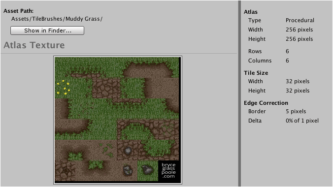

Provides information about active tileset along with preview of atlas texture. Additional
metrics are shown to right of atlas preview.



Path of tileset assets is displayed at top of interface which is relative to the project
folder. Tilesets usually comprise of a number of assets (tileset asset, material, autotile
atlas texture) which are grouped into folders for convenience.

Click **Show in Finder...** (OS X) or **Show in Explorer...** (Windows) to reveal contents
of folder.

>
> **Note** - Tileset brushes are stored inside their respective tileset assets.
>


## Atlas / Autotile Atlas

Layout (autotile only)
: Indicates whether autotile atlas was generated from a basic or extended layout.

Inner Joins (autotile only)
: Indicates whether autotile atlas includes the artwork for inner join tiles.

Type
: Indicates whether tileset brushes are procedural or non-procedural by default. This
  option can be overridden by individual tileset brushes.

Width, Height
: Size of atlas texture in pixels. The reflected size may differ from the actual size of
  the texture image according to the way its import settings are specified within Unity.

Rows, Columns
: Maximum number of rows and columns of tiles within atlas.


## Tile Size

Size of single tile in pixels excluding any additional border size.


## Edge Correction

Border
: Border size in pixels that surrounds each tile. The offset between tiles can be
  calculated as:

  ```
  Horizontal Offset = Tile Width  + ( Border Size × 2 )
  Vertical Offset   = Tile Height + ( Border Size × 2 )
  ```

Delta
: UV coordinates can be inset by a small amount to avoid visual artifacts when viewed. The
  UV delta specifies the percentage of a pixel to indent by.
