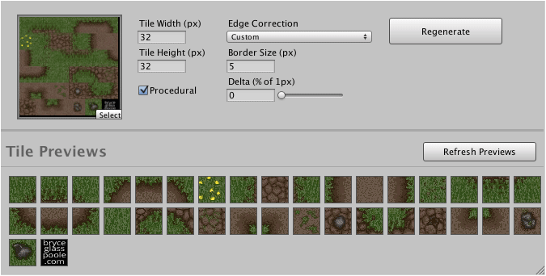

Allows you to modify to existing tilesets. In the case of autotile tilesets it is also
possible to regenerate the atlas texture from the input autotile artwork.

Tile previews are rendered for the specified tileset at actual size. Some modifications
require additional processing before previews can be displayed. In such cases the 
**Refresh Previews** button can be clicked. For performance reasons the maximum number of
tile previews displayed is constrained.
