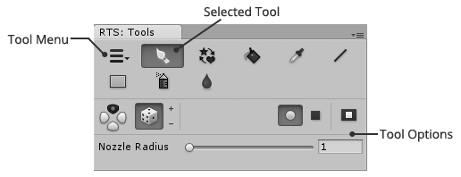

The tool palette is the main entry point for 'rotorz/unity3d-tile-system' and contains
tools which can be used to interact with tile systems. Additional 'rotorz/unity3d-tile-system'
features can be accessed via the main tool menu.

This window can be accessed via the menu **Window | Rotorz Tile System**.

## Tool Buttons

A number of tools are provided allowing you to interact with tile systems in various ways.
Visibility and ordering of tool buttons can be adjusted using the preferences window.

Tools can only be selected when your scene contains at least one tile system. The first
tile system in your scene will become active when one is not already active. Selected tool
can then be used to interact with the active tile system.

Additional options relating to selected tool are shown below when available. For more
information regarding each of the provided tools and their accompanying options refer to
[Tools].

##  Tool Menu

Displays a popup menu allowing you to access the various features offered by
'rotorz/unity3d-tile-system' including the various palette windows.

**Create Tile System...**
: Create a new tile system.

  See [Creating a Tile System].

**Create Brush or Tileset...**
: Create a new brush or tileset.
  
  See [Brushes].

**Use as Prefab Offset**
: Use manual alignment, rotation and scale offsets of selected tile object as prefab
  offset so that such tiles are aligned correctly in the future.

  See [Offset, Rotate and Scale Prefabs].

**Replace by Brush...**
: Find tiles that were painted using a specific brush and repaint them using another brush.
  Find and replace for tiles!

  See [Replace by Brush].

**Build Scene...**
: Optimize all tile systems in scene using per tile system properties and then save as
  separate optimized scene.

  See [Building Entire Scene].

**Rescan Brushes**
: Scan project for new or missing brushes; useful for occasions where brushes have been
  imported from an asset package.

**Editor Windows | Designer**
: Shows designer for selected brush or tileset.

  See [Designer Window].

**Editor Windows | Scene**
: Shows list of editable tile systems in current scene and highlights the active one.

  See [Scene Palette].

**Editor Windows | Brushes**
: Palette window allowing you to view and filter brushes. You can then paint tiles using
  the selected brush.

  See [Brush Palette].

**Online Resources**
: Various links to online resources for the 'rotorz/unity3d-tile-system' package.

**Preferences...**
: Use to tweak various preferences including the coloring of tile system grids.
  
  See [User Preferences].

**About...**
: Information about 'rotorz/unity3d-tile-system' including the version and commit hash.

##  Context Menu

The tool palette window adds a command to the Unity editor window context menu allowing
you to reset tool options.

**Reset Tool Options**
: Reset options of each tool to their default values. This command does not reset user
  preferences (see [User Preferences]).

[Brush Palette]: ./Brush-Palette.md
[Brushes]: ./Brushes.md
[Building Entire Scene]: ./Building-Entire-Scene.md
[Creating a Tile System]: ./Creating-a-Tile-System.md
[Designer Window]: ./Designer-Window.md
[Offset, Rotate and Scale Prefabs]: ./Offset,-Rotate-and-Scale-Prefabs.md
[Replace by Brush]: ./Replace-by-Brush.md
[Scene Palette]: ./scene-palette.m
[Tools]: ./Tools.md
[User Preferences]: ./User-Preferences.md
