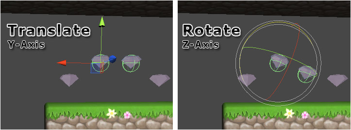

Non-procedural tiles can be manually tweaked, moved, rotated and scaled once they have
been painted.

It is also possible to add, remove and tweak the properties of painted tile components
using the inspector. This is sometimes useful when painting various active items such as
collectables, enemies, trigger points, etc.

>
> **Note** - Manual tweaks will usually be retained, however some actions may cause such
> changes to be lost.
>
