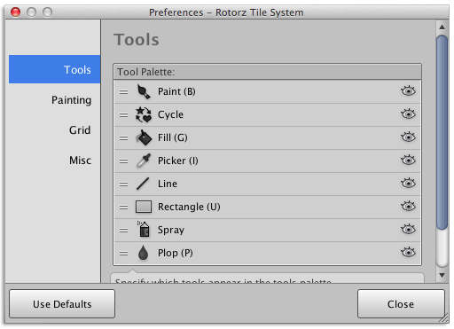

A number of preferences have been exposed allowing you to customize the appearance and
functionality of 'rotorz/unity3d-tile-system'. The user preferences window also includes a
button allowing you to restore the default values.



This interface can be displayed via the tool menu ** |
User Preferences...**

As you might expect, preferences are stored globally and are shared between all projects
that make use of 'rotorz/unity3d-tile-system'. Preferences are stored in a JSON data file
inside your application data directory which varies according to operating system:

- **Windows:** "C:\Users\{UserName}\AppData\Roaming\Rotorz\Rotorz Tile System\Settings.json"

- **OS X:** "/Users/{UserName}/.config/Rotorz/Rotorz Tile System/Settings.json"


## Tools

**Tool Palette**
: Drag listed tools to reorder them in the tools palette. You can also customize which
  tools are shown:

  -  - Shown when tool is visible, click to hide tool.

  -  - Shown when tool is hidden, click to reveal tool.

**Automatically show tool palette upon activating tool**
: Indicates whether tool palette should be shown when activating tool using hot-key or via
  API since tools can be used without tool palette window being shown.

**Join tool and brush palettes**
: When active the **Tool** and **Brush** palette windows are combined into a single window
  offering a similar experience to the original user interface, and has been included for
  those who have become accustomed with the original tile system panel.


## Painting

**Erase empty chunks**
: Indicates whether chunk game objects should be removed from scene as they become empty:
  
  - **Yes** (default) - Chunks should be erased when they become empty. This can cause a
    minor pause when chunks are repeatedly removed and then re-added as a result of
	painting; though it helps to avoid including unnecessary chunks in your scene.

  - **No** - Leave chunks even though they are empty.
  
  - **Per Tile System** - Use per tile system stripping option to determine whether empty
    chunks should be erased.

**Preferred nozzle indicator**
: Nozzle indicator is used to highlight location of tile that will be painted by the
  selected tool:

  - **Automatic** (default) - Allow brush to determine which indicator to use.

  - **Wireframe** - Wireframe cube should be used to highlight active tile when possible.

  - **Flat** - Flat shaded tile should be used to highlight active tile when possible.

  Color of nozzle can be adjusted by specifying a custom wireframe and shading color.
  Alpha component of color can be used to control opacity of nozzle indicator.

**Display immediate previews**
: Shows preview prior to painting tile making it easier to visualize and align larger
  tiles. Preview may not always reflect exact output of some brushes and can be disabled
  on per brush basis if desired.

  Preview can be tinted with custom color where alpha component controls opacity of color
  tint.

  >
  > **Note** - Appearance of immediate previews can be customized by adjusting the
  > "Rotorz/Preview" or "Rotorz/Preview See Through" shaders which are located in
  > "/Assets/Rotorz/Tile System/Shaders/".
  >

**See-through previews**
: When enabled you can see-through existing tiles to reveal preview of replacement tile.

  >
  > **Note** - Holding the control key whilst painting will temporarily toggle the value
  > of this preference.
  >


## Grid

**Colors**
: Customize color of tile system grid lines in scene view where alpha component controls
  opacity of background/grid lines.

**Highlight active tile system**
: Shows fainter grid for active tile system even when not actually selected for a useful
  visual guide when manually aligning objects.

**Display grid lines**
: Specifies whether grid lines should be shown in scene view for selected tile systems.

**Display chunk boundaries**
: Specifies whether chunk boundaries should be highlighted for selected tile systems.

**Hide scene view grid upon activating tool**
: Specifies whether Unity's placement grid should be temporarily hidden in scene views
  when a 'rotorz/unity3d-tile-system' tool is active.


## Misc

**Preferred Language (BETA)**
: This is an early preview for an option which allows the user interfaces of
  'rotorz/unity3d-tile-system' to be shown in other languages.

  Localized strings are resolved in the following way:

  ```
  Default strings written in source code (en-US)
  |-- Plugins/Packages/@rotorz/unity3d-tile-system/Languages/{active-language}.mo
      |-- Plugins/PackageData/@rotorz/unity3d-tile-system/Languages/{active-language}.mo
  ```

  Strings that are defined in a custom language file will override the string from the
  inherited language. This is useful in situations where you find a particular translation
  confusing and would like to customize it; or when developing new translations.
  
  The small refresh button to the side forces a reload of the current "Prefferred Language"
  which is useful when the contents of language files has changed.

**Enable warning when creating large tile systems**
: By default a warning message is displayed when creating large tile systems. This warning
  can be suppressed by deselecting this preference.

**Show detailed tips when available**
: Detailed tips are available in some user interfaces to provide extra information. Such
  interfaces usually provide an option to quickly toggle this preference on or off.

**Display custom cursors**
: Custom cursors have been added for tools providing useful visual hints though these can
  be disabled to assume default arrow cursor.

**Always center utility windows.**
: Utility windows are normally only centered upon first being shown. Enable this preference
  to center utility windows each time they are shown.
