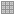
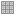
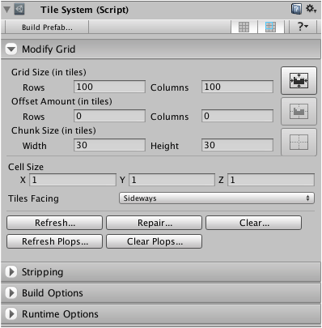

A specialized inspector is provided allowing you to modify and configure tile systems
after they have been created. Multiple tile systems can be inspected at the same time.

## Accessing the Inspector

### Steps

1. Select the tile system that you would like to inspect.

2. Ensure that the **Inspector** window is shown by selecting **Window | Inspector**.

3. Scroll to the **Tile System** component inside the **Inspector** window.

## Inspector Interface

The inspector interface is split into sections which can be shown or hidden as needed.
The more advanced functionality is hidden by default when 'rotorz/unity3d-tile-system' is
first used.

The menu strip at the top of the interface allows you to save the tile system as a prefab,
or alternatively save an optimized version as a prefab. Toggle visibility of grid lines by
clicking , or visibility of chunk boundaries
by clicking .

