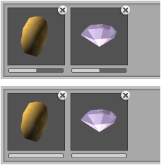
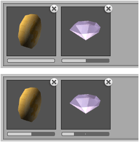
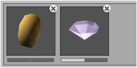

Chance of variations being picked when painting with randomization can be adjusted using
weight slider shown immediately below variation preview in oriented brush designer.

Variations which share the same weight have an equal chance of being picked when using
randomization. For instance, both of the following examples provide the same behavior:

In the following two equivalent examples the coin variation should be picked twice for
each diamond which is picked (on average) when painting:

## Adjust Variation Weight for Entire Column

Sometimes it is useful to adjust weight for an entire column of variations within an
oriented brush; for instance, the first variation within each orientation.

To achieve this hold **Ctrl** whilst dragging variation slider in any orientation.

## Exclude Variation From Randomization

Specify a weight of zero to remove variation from being randomly picked. First variation
is assumed when all available variations have a weight of zero. For instance, the
following will always paint diamond variations when randomization is being used:

