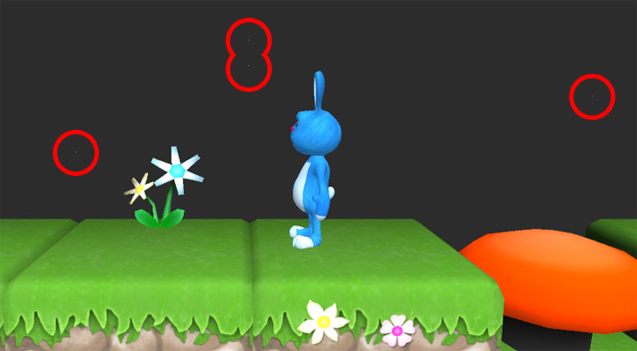

Often vertices around tile joins are supposed to occupy the exact same position but often
don't due to small inaccuracies.

Inaccurate vertex alignment can lead to visual artifacts such as the glitter-like effect
shown in the illustration below. This undesirable effect can be eliminated by snapping the
positions of vertices that are supposed to occupy the same space (provided that the design
of the tiles allows for this).

Vertices within a given threshold (by default 0.001) will be snapped to occupy the same
space. The threshold can be adjusted if necessary using the **Inspector** panel by
selecting the tile system in question and altering the property **Vertex Snap Threshold**.

>
> **Note** - Background texture was removed from above illustration to make the glitter-like
> issue easier to see.
>
