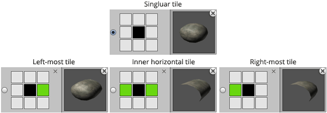
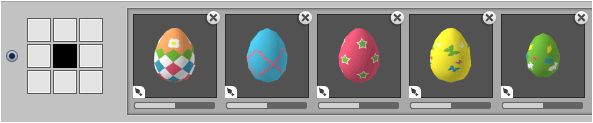

The orientation of a tile is defined by the tiles that surround it which allows oriented
brushes to make automatic selections.

One or more tile variations can be specified for each defined orientation. The following
illustrates the oriented brush that was used to randomly paint eggs when designing levels
for *Munchy Bunny!*

>
> **Note** - "Egg" is an oriented brush where only the default orientation is used.
>
