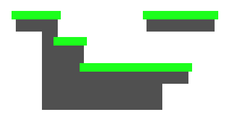

Specifies that edge correction should be disabled. This can be useful when blocky
"pixel-like" graphics are desired when using point filtering, though edge correction is
generally more effective.

The following points may be helpful when using this option:

- Disable mip-mapping for texture.

- Use true color format (i.e. disable compression).

- Ensure that both tile system and camera positions are round numbers.

- Some people suggest adding 0.5 to rounded positions.

>
> **Tip** - It is usually better to utilize one of the edge correction options to reduce
> the effects of bleeding at edges.
>
